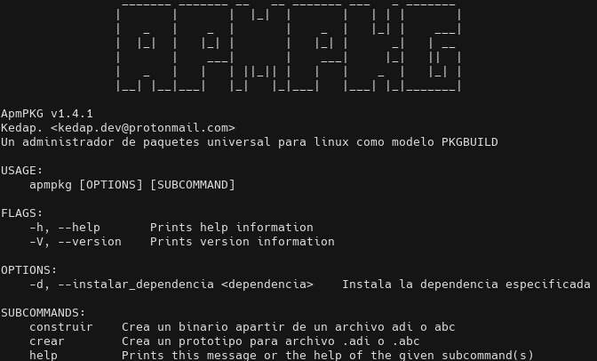
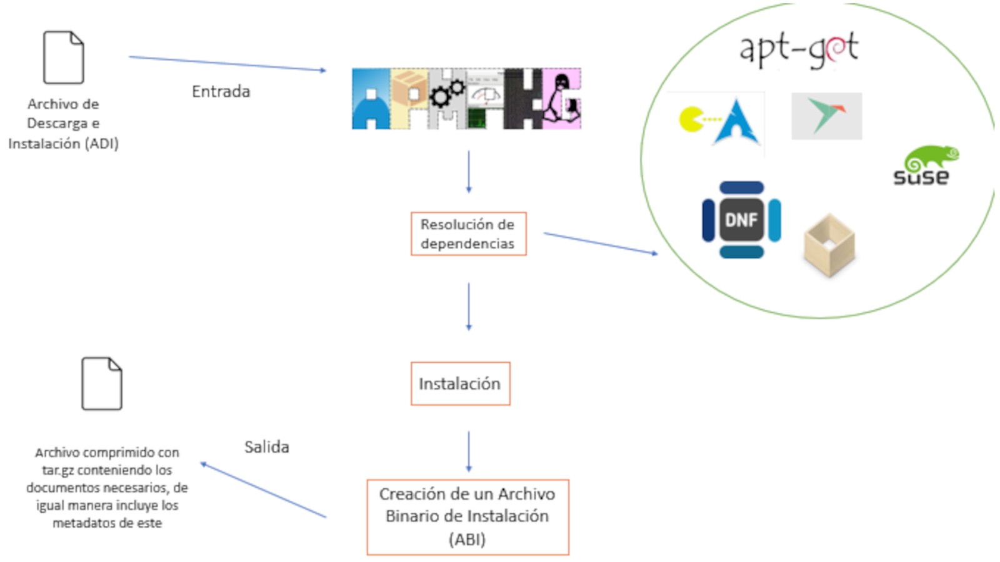

# ApmPKG
    

A Package Manager as a model: PKGBUILD

  

[English](./README_en.md)

# NOTICIAS
- Se ha liberado la versión: v1.5.2 Para todos!!!
- Creación de los binarios para todas las distribuciones disponibles
- Se a subido ApmPKG esta en [AUR](https://aur.archlinux.org/packages/apmpkg/)
- Se agregaron completions para Bash y Zsh
- La instalación con los binarios de Debian ya no ocasionan errores
- ApmPKG utiliza librerías en vez de utilizar comandos, por excepción de `install`
- Sobre la documentación para [krep0](krep0.bitbucket.io/) ya ha sido actualizada

* * *
Un gestor de paquetes que desea ser una poderosa herramienta universal para Linux con el fin de la creación e instalación de paquetes.

## Crear paquetes

Esta es una herramienta escrita en rust y bash, que utiliza gestores de
paquetes nativos para la resolución de dependencias, se pueden crear paquetes
desde un archivo simple con sintaxis TOML y hasta puedes de igual manera
crearlo desde un PKGBUILD! Los gestores que son soportado por ApmPKG:

- [x] Apt
- [x] Pacman
- [x] Dnf
- [x] Snap
- [x] Flatpak
- [x] Zypper
- [x] Yum
- [x] Apk
- [x] Pkg (termux)
- [x] Slapt-get
- [x] Nix
- [ ] Emerge
- [ ] Yay

De igual manera se pueden crear binarios para una instalación offline
[binarios](doc/modos_de_instalacion.md/#instalacion-desde-un-archivo-binario-de-instalacion)
para saber [mas información aquí](doc/modos_de_instalacion.md)

## Instalación
* * *
Aunque sea algo difícil o raro, de igual manera podemos instalar apmpkg con el
mismo apmpkg, aun porque creemos que la distribución de paquetes es importante
tratamos de poner a disposición y de crear binarios nativos para cada
distribución en donde son soportados los gestores de paquetes,  pero primero
debes de tener las dependencias, entre ellos: 

- pip3/pip2
- npm
- bundle
- wget
- fakeroot
- git
- rsync

Para ello puedes dirigirte a la sección de
[lanzamientos](https://github.com/Kedap/apmpkg/releases/) en donde se suben los
paquetes, si deseas tener mas información, [da click aquí](doc/instalacion.md)

# Características

- Creación de paquetes de para lenguajes de scripting, un claro ejemplo es
  Python, Java JavaScript / Typescript y Ruby. Con soporte de pip, bundle y npm
  [mas información aquí](doc/creando_paquetes.md/#adi)
- Facilidad de creación de paquetes sobre el modelo de [PKGBUILD de arch
  Linux](https://wiki.archlinux.org/index.php/PKGBUILD) es decir que tenemos
  soporte para AUR, aun que tenemos ciertas [limitaciones para decir que
  tenemos soporte para todos los PKGBUILD's
  existentes](doc/creando_paquetes.md/#complicaciones-abc) pero de igual manera
  estamos trabajando en eso
- Resolución de dependencias con los gestores de paquetes antes mencionados, trabajaremos para que la lista sea mas extensa
- Descargar y/o compilar desde una URL, ejemplo: `apmpkg instalar -u https://foo.com/bar`
- Extinciones propios de nuestra herramienta, *.adi, .abc y .abi.tar.gz* cada una tiene una función especial, [mas información aquí](doc/modos_de_instalacion.md)
- Crear un prototipo para un generar un archivo .adi o .abc, con el comando:
  `apmpkg crear adi foo` en el caso de crear un archivo .abc se debe de
  ejecutar lo siguiente: `apmpkg crear abc foo`
- Construir tus binarios, Con la llegada de la version 1.2 se puede construir
  binarios sin la necesidad de instalarlos, solo debes de ejecutar: `apmpkg
  construir foo.adi` o si es un paquete .abc: `apmpkg construir foo.abc`
- Con la llegada de la versión 1.3 se puede ejecutar scripts post instalación [mas información aquí](doc/creando_paquetes.md/#instalacion)
- En la versión 1.4 se pueden ejecutar scripts pre instalación
- A partir de la versión 1.5 se pueden colocar archivos dentro de `/home`

## Contribuir
Si tienes una buena idea o quieres contribuir con este proyecto puedes empezar por [aqui](https://github.com/Kedap/apmpkg/issues) y [leer esto](CONTRIBUTING.md)

## FAQ / Preguntas frecuentes

**¿Realmente es universal para TODAS las distribuciones GNU/Linux disponibles?**

No, solo para aquellas que tenemos soporte para las dependencias, gestores de paquetes y arquitectura de estos.
De igual manera no todas las dependencias se llaman igual en todas las distribuciones que al igual se 
soluciona al preguntar por algún nombre de dependencias alternativas que se encuentre en sus gestor de paquete de preferencia

**¿Porque no existe un binario para X distribución si el gestor X esta disponible?**

Aunque intentemos hacer eso no podemos, generamos los binario de las
distribuciones mas utilizadas y aparte cada distribución tiene sus
arquitecturas y maneras de empaquetado, en el caso de que no brindemos dicho
binario se recomienda altamente [compilarlo](doc/modos_de_instalacion.md)

**¿Existe una documentación en ingles / Is there an English documentation?**

Esta en nuestro planes agregar una documentación en ingles. It will soon be available 

**¿Porque no implementan X característica?**

Por lo mismo, pues no compartes tu idea, estaremos felices de conocer tu idea,
puedes apoyar [aquí](https://github.com/Kedap/apmpkg/issues) y/o si quieres mas
información [aquí](CONTRIBUTING.md)
