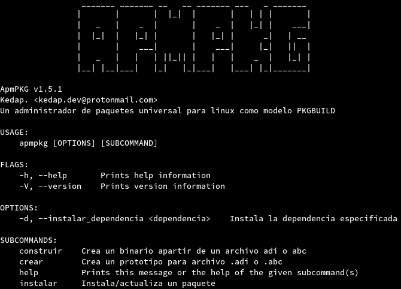

# ApmPKG
 

A Package Manager as a model: PKGBUILD

# NOTICIAS
- Se ha liberado la primera versión: v0.1 Para todos!!!
- Creacion de los binarios de instalacion
- Se a subido ApmPKG esta en AUR
* * *
Un gestor de paquetes que desea ser una poderosa herramienta universal para linux con el fin de la cracion e instalacion de paquetes.

## Crear paquetes

Esta es una herramienta escrita en rust y bash, que utiliza gestores de paquetes nativos para la resolucion de dependencias, se pueden crear paquetes desde un archivo simple con sintaxis TOML y hasta puedes de igual manera crearlo desde un PKGBUILD!
Gestores de paquetes soportado por ApmPKG

- [x] Apt
- [x] Pacman
- [x] Dnf
- [x] Snap
- [x] Flatpak
- [x] Zypper
- [ ] Emerge
- [ ] Yay
- [ ] Pkg (termux)
- [ ] Yum
- [ ] Apk

De igual manera se pueden crear binarios para una instalacion offline [binarios](doc/modos_de_instalacion.md/#instalacion-desde-un-archivo-binario-de-instalacion) para saber [mas infomarcion aqui](doc/modos_de_instalacion.md)

## Instalacion
* * * 
Aunque sea algo dificl o raro, de igual manera podemos instalar apmpkg con el mismo apmpkg, aun porque creemos que la distribucion de paquetes es importante tratamos de poner a disposicion y de crear binarios nativos para cada distribucion en donde son soportados los gestores de paquetes,  pero primero debes de tener las depencias, entre ellos: 
- pip3/pip2
- bundle 
- curl 
- fakeroot 
- git
Para ello puedes dirijirte a la seccion de [lanzamientos(link)] en donde se suben los paquetes, si deseas tener mas informacion, [da click aqui](doc/instalacion.md)

# Caracteristicas

- Creacion de paquetes de para lenguajes de script, un claro ejemplo es python y ruby. Con soporte con pip y bundle [mas info aqui](doc/creando_paquetes.md/#adi)
- Facilidad de creacion de paquetes sobre el modelo de [PKGBUILD de archlinux](https://wiki.archlinux.org/index.php/PKGBUILD) es decir que tenemos soporte para AUR, aun que tenemos ciertas [limitaciones para decir que tenemos soporte para todos los PKGBUILD's existentes](doc/creando_paquetes.md/#complicaciones-abc) pero de igual manera estamos trabajando en eso
- Resolucion de dependencias con los gestores de paquetes antes mencionados, trabajaremos para que la lista sea mas extensa
- Descargar y/o compilar desde una url, ejemplo: `apmpkg instalar -u https://foo.com/bar`
- Extenciones propios de nuestra herramienta, *.adi, .abc y .abi.tar.gz* cada una tiene una funcion especial, [mas informacion aqui](doc/modos_de_instalacion.md)

## Contribuir
Si tienes una buena idea o quieres contribuir con este proyecto puedes empezar por [aqui](https://github.com/Kedap/apmpkg/issues) y [leer esto](CONTRIBUTING.md)

## FAQ / Preguntas frecuentes

**¿Realmente es universal para TODAS las distribuciones gnu/linux disponibles?**

No, solo para aquellas que tenemos soporte para las dependencias, gestores de paquetes y arquitectura de estos.

**¿Porque no implentan X caracteristica?**

Por lo mismo, pues no compartes tu idea, estaremos felices de conocer tu idea, puedes apoyar [aqui](https://github.com/Kedap/apmpkg/issues) y/o si quieres mas informacion [aqui](CONTRIBUTING.md)
