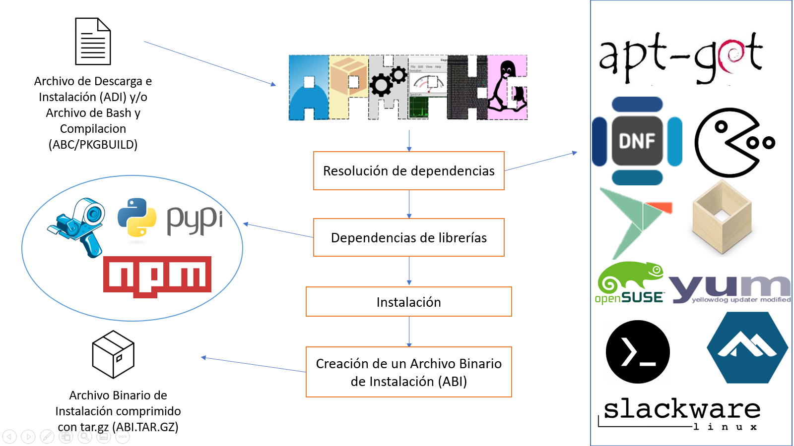

# ApmPKG
    

A Package Manager as a model: PKGBUILD

  

[Spanish]("./README.md")

# NEWS
- Version has been released: v1.5 For everybody!!!
- Creation of the binaries for all available distributions
- ApmPKG is uploaded is in [AUR](https://aur.archlinux.org/packages/apmpkg/)
- Adding support for Nix
- Fixing the bug caused with `apmpkg create abc hello-world`
- You can add files in `/home` of different users
- In binary installation the pre-installation scripts are not executed

* * *
A package manager that wants to be a powerful universal tool for Linux in order to create and install packages.

## Creating packages

This is a tool written in rust and bash, that uses native package managers for the resolution of dependencies, you can create packages from a simple file with TOML syntax and you can even create it from a PKGBUILD!
The managers that are supported by ApmPKG:

- [x] Apt
- [x] Pacman
- [x] Dnf
- [x] Snap
- [x] Flatpak
- [x] Zypper
- [x] Yum
- [x] Apk
- [x] Pkg (termux)
- [x] Slapt-get
- [x] Nix
- [ ] Emerge
- [ ] Yay

In the same way, binaries can be created for an offline installation. [binary](doc/modos_de_instalacion.md/#instalacion-desde-un-archivo-binario-de-instalacion) to know [more information here](doc/modos_de_instalacion.md)

## Intallation
* * *
Although it is something difficult or strange, in the same way we can install apmpkg with the same apmpkg, even because we believe that the distribution of packages is important we try to make available and create native binaries for each distribution where package managers are supported, but first you must have the dependencies, among them:
- pip3/pip2
- npm
- bundle
- wget
- fakeroot
- git
- rsync

For this you can go to the section of [release](https://github.com/Kedap/apmpkg/releases/) where the packages are uploaded, if you want to have more information, [click here](doc/instalacion.md)

# Feature

- Creation of packages for scripting languages, a clear example is python, javascript / typescript and ruby. With support with pip, bundle and npm [more information here](doc/creando_paquetes.md/#adi)
- Ease of creation of packages on the model [PKGBUILD of archlinux](https://wiki.archlinux.org/index.php/PKGBUILD) that is, we have support for AUR, although we have certain [limitations to say that we have support for all existing PKGBUILD](doc/creando_paquetes.md/#complicaciones-abc) but in the same way we are working on that
- Dependency resolution with the package managers mentioned above, we will work to make the list more extensive
- Download and / or compile from a url, example: `apmpkg instalar -u https://foo.com/bar`
- Extensions of our tool, *.adi, .abc y .abi.tar.gz* each one has a special function, [more information here](doc/modos_de_instalacion.md)
- Create a prototype for a generate a .adi or .abc file, with the command: `apmpkg crear adi foo` In the case of creating an .abc file, the following must be executed: `apmpkg crear abc foo`
- Build your binaries, With the arrival of version 1.2 you can build binaries without the need to install them, you just have to run: `apmpkg construir foo.adi` or if it is an .abc package: `apmpkg construir foo.abc`
- With the arrival of version 1.3 you can run post installation scripts [more information here](doc/creando_paquetes.md/#instalacion)
- In the version 1.4 pre-install scripts can be run
- Apartir de la version 1.5 se pueden colocar archivos dentro de `/home`

## Contribute
If you have a good idea or want to contribute to this project you can start with [here](https://github.com/Kedap/apmpkg/issues) and [read this](CONTRIBUTING.md)

## FAQ / Frequently Asked Questions

**Is it really universal for ALL available gnu / linux distributions?**

No, only for those that we have support for dependencies, package managers and their architecture.
in the same way, not all dependencies are called the same in all distributions that are similarly
solves by asking for some alternative dependency name found in your preferred package manager

**Why is there no binary for X distribution if the X manager is available?**

Although we try to do that we cannot, we generate the binaries of the most used distributions and apart each distribution has its architectures and packaging ways, in the event that we do not provide said binary it is highly recommended to [compile it](doc/installation_modes.md)

**¿Existe una documentacion en ingles / Is there an English documentation?**

Esta en nuestro planes agregar una documentacion en ingles. It will soon be available 

**Why don't they implement X feature?**

For the same reason, because you do not share your idea, we will be happy to know your idea, you can support [here](https://github.com/Kedap/apmpkg/issues) and/or if you want more information [here](CONTRIBUTING.md)
